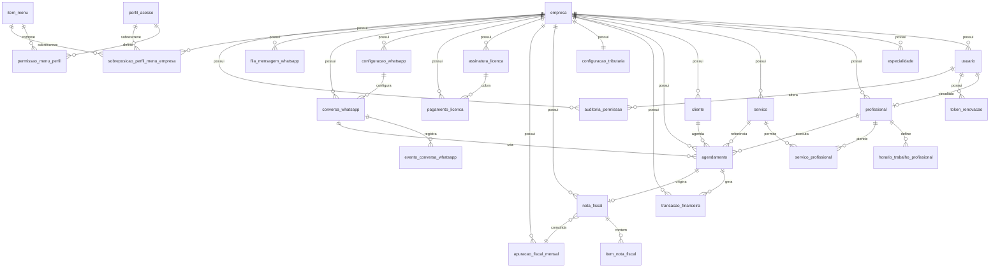

# Estrutura da Base de Dados Relacional

Objetivo: desenhar a estrutura relacional do sistema com foco em relacionamento entre entidades, cardinalidade e regras de integridade.

## 1. Premissas
- Banco relacional: PostgreSQL.
- Multiempresa logico: tabelas internas com `empresa_id`.
- Chaves primarias: `id` UUID.
- Regra geral de integridade: `ON UPDATE CASCADE` e `ON DELETE RESTRICT`, exceto tabelas de associacao N:N.

## 2. Diagrama ER (visao integrada)

## 3. Relacionamentos principais (cardinalidade)
- `empresa 1:N usuario`
- `empresa 1:N profissional`
- `empresa 1:N servico`
- `servico N:N profissional` via `servico_profissional`
- `cliente 1:N agendamento`
- `profissional 1:N agendamento`
- `servico 1:N agendamento`
- `agendamento 1:N transacao_financeira`
- `agendamento 1:0..1 nota_fiscal`
- `nota_fiscal 1:N item_nota_fiscal`
- `empresa 1:1 configuracao_tributaria`
- `assinatura_licenca 1:N pagamento_licenca`
- `conversa_whatsapp 1:N evento_conversa_whatsapp`
- `perfil_acesso N:N item_menu` via `permissao_menu_perfil`
- `empresa + perfil_acesso + item_menu` sobrescrito em `sobreposicao_perfil_menu_empresa`

## 4. Tabelas e chaves estrangeiras

### 4.1 Nucleo
- `usuario.empresa_id -> empresa.id`
- `token_renovacao.usuario_id -> usuario.id`

### 4.2 Agenda e cadastro
- `profissional.empresa_id -> empresa.id`
- `profissional.usuario_id -> usuario.id` (nullable para profissional sem login)
- `horario_trabalho_profissional.profissional_id -> profissional.id`
- `servico.empresa_id -> empresa.id`
- `servico_profissional.servico_id -> servico.id`
- `servico_profissional.profissional_id -> profissional.id`
- `cliente.empresa_id -> empresa.id`
- `agendamento.empresa_id -> empresa.id`
- `agendamento.cliente_id -> cliente.id`
- `agendamento.profissional_id -> profissional.id`
- `agendamento.servico_id -> servico.id`

### 4.3 Financeiro e licenca
- `transacao_financeira.empresa_id -> empresa.id`
- `transacao_financeira.agendamento_id -> agendamento.id` (nullable para lancamento manual)
- `assinatura_licenca.empresa_id -> empresa.id`
- `pagamento_licenca.empresa_id -> empresa.id`
- `pagamento_licenca.assinatura_id -> assinatura_licenca.id`

### 4.4 Fiscal
- `configuracao_tributaria.empresa_id -> empresa.id` (unique)
- `nota_fiscal.empresa_id -> empresa.id`
- `nota_fiscal.agendamento_id -> agendamento.id` (nullable)
- `item_nota_fiscal.nota_fiscal_id -> nota_fiscal.id`
- `apuracao_fiscal_mensal.empresa_id -> empresa.id`

### 4.5 WhatsApp assistente
- `configuracao_whatsapp.empresa_id -> empresa.id` (unique por numero_remetente)
- `conversa_whatsapp.empresa_id -> empresa.id`
- `conversa_whatsapp.servico_id -> servico.id` (nullable por etapa)
- `conversa_whatsapp.profissional_id -> profissional.id` (nullable por etapa)
- `evento_conversa_whatsapp.conversa_id -> conversa_whatsapp.id`
- `fila_mensagem_whatsapp.empresa_id -> empresa.id`

### 4.6 RBAC dinamico por banco
- `permissao_menu_perfil.perfil_id -> perfil_acesso.id`
- `permissao_menu_perfil.item_menu_id -> item_menu.id`
- `sobreposicao_perfil_menu_empresa.empresa_id -> empresa.id`
- `sobreposicao_perfil_menu_empresa.perfil_id -> perfil_acesso.id`
- `sobreposicao_perfil_menu_empresa.item_menu_id -> item_menu.id`
- `auditoria_permissao.empresa_id -> empresa.id`
- `auditoria_permissao.ator_usuario_id -> usuario.id`
- `auditoria_permissao.perfil_id -> perfil_acesso.id`
- `auditoria_permissao.item_menu_id -> item_menu.id`

## 5. Constraints recomendadas
- `unique (servico.empresa_id, servico.nome)`
- `unique (profissional.empresa_id, profissional.email)` quando email existir
- `unique (cliente.empresa_id, cliente.telefone)`
- `unique (servico_profissional.servico_id, servico_profissional.profissional_id)`
- `unique (agendamento.empresa_id, profissional_id, data, horario_inicio)`
- `unique (nota_fiscal.empresa_id, numero, serie, tipo)`
- `unique (apuracao_fiscal_mensal.empresa_id, ano, mes)`
- `unique (pagamento_licenca.pagamento_externo_id)`
- `unique (evento_conversa_whatsapp.message_id)` para idempotencia
- `unique (permissao_menu_perfil.perfil_id, item_menu_id)`
- `unique (sobreposicao_perfil_menu_empresa.empresa_id, perfil_id, item_menu_id)`

## 6. Regras de delecao (resumo)
- `empresa`: nao excluir fisicamente em producao (soft delete/logico).
- `servico` e `profissional`: inativacao, nao delecao fisica.
- `agendamento`, `nota_fiscal`, `transacao_financeira`: dados historicos, nao deletar.
- `servico_profissional` e tabelas de permissao/sobreposicao: permitem delecao fisica controlada.

## 7. Indices obrigatorios (minimo)
- `agendamento (empresa_id, data)`
- `agendamento (empresa_id, profissional_id, data, horario_inicio)`
- `agendamento (empresa_id, status, data)`
- `servico (empresa_id, ativo)`
- `profissional (empresa_id, ativo)`
- `transacao_financeira (empresa_id, data, tipo)`
- `nota_fiscal (empresa_id, data_emissao, status)`
- `apuracao_fiscal_mensal (empresa_id, ano, mes)`
- `conversa_whatsapp (empresa_id, telefone_cliente, estado_atual)`
- `evento_conversa_whatsapp (conversa_id, criado_em)`
- `item_menu (ativo, ordem)`
- `permissao_menu_perfil (perfil_id, item_menu_id)`

## 8. Ordem de implementacao sugerida
1. Nucleo multiempresa (`empresa`, `usuario`, `token_renovacao`).
2. Agenda/cadastro (`servico`, `profissional`, `cliente`, `agendamento`).
3. Financeiro (`transacao_financeira`) e licenca (`assinatura_licenca`, `pagamento_licenca`).
4. Fiscal (`configuracao_tributaria`, `nota_fiscal`, `item_nota_fiscal`, `apuracao_fiscal_mensal`).
5. WhatsApp assistente (`configuracao_whatsapp`, `conversa_whatsapp`, `evento_conversa_whatsapp`, `fila_mensagem_whatsapp`).
6. RBAC dinamico (`item_menu`, `perfil_acesso`, `permissao_menu_perfil`, sobreposicoes e auditoria).
